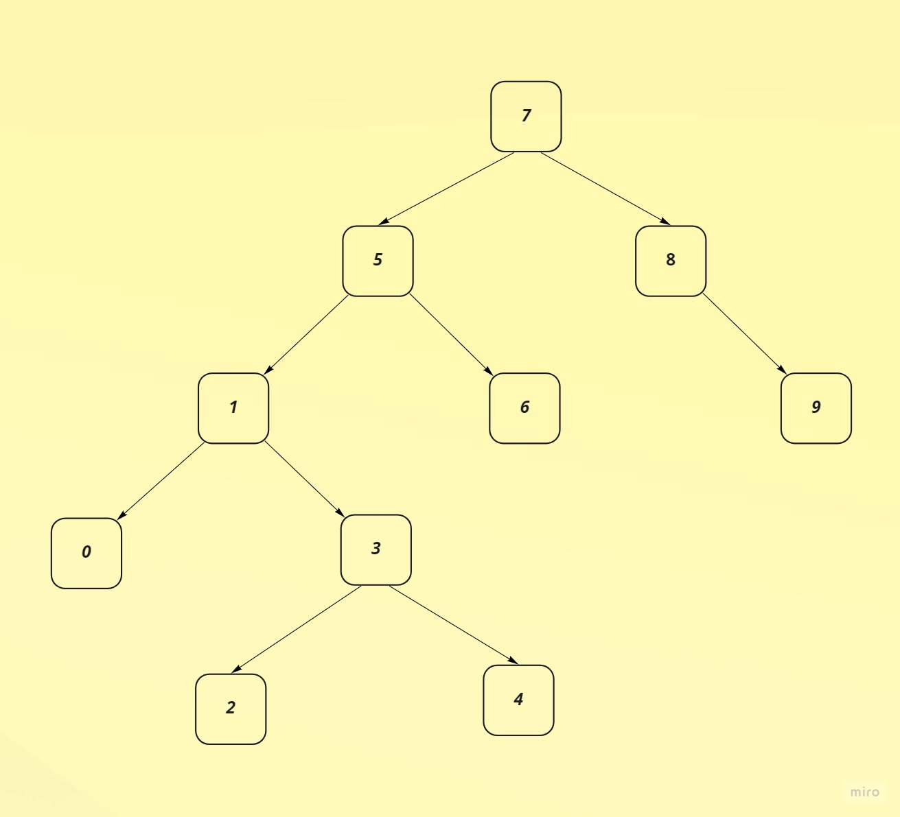

# Binary-Search-Tree
## Patika Data Structures &amp; Algorithms Homework
## 1. [7, 5, 1, 8, 3, 6, 0, 9, 4, 2] dizisinin Binary-Search-Tree aşamalarını yazınız.
### Örnek: root x'dir. root'un sağından y bulunur. Solunda z bulunur vb.

 **Root=7** olarak seçilmiştir.
 
